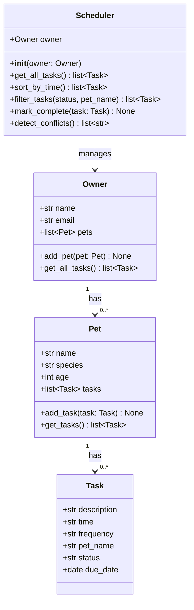

# PawPal+ UML — Draft (Phase 1)

> Render this in VS Code with the Mermaid Preview extension, or paste into https://mermaid.live

## Relationships

| Relationship | Type | Notes |
|---|---|---|
| Owner → Pet | One-to-many composition | An Owner holds a list of Pet objects |
| Pet → Task | One-to-many composition | A Pet holds a list of Task objects |
| Scheduler → Owner | Association | Scheduler reads from Owner; doesn't own it |
