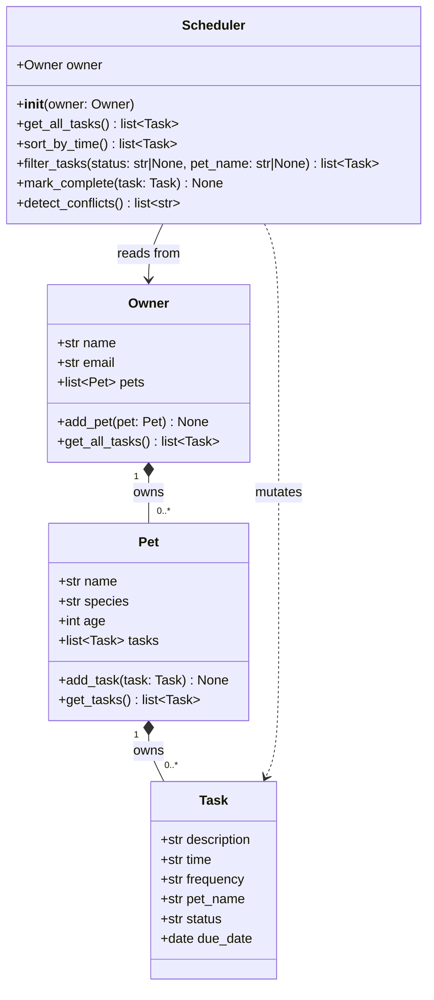

# PawPal+ UML — Final (Phase 6)

> Render in VS Code with Mermaid Preview, or paste into https://mermaid.live
> Updated to reflect final implementation in pawpal_system.py



## Changes from Phase 1 draft

| Item | Draft | Final |
|---|---|---|
| `filter_tasks` signature | `(status, pet_name)` | `(status: str\|None, pet_name: str\|None)` — explicitly optional |
| `Owner → Pet` arrow | `-->` association | `*--` composition (Owner owns Pets, they don't exist independently) |
| `Pet → Task` arrow | `-->` association | `*--` composition (same reason) |
| `Scheduler → Task` | not shown | `..>` dashed — Scheduler mutates Tasks via `mark_complete()` |
```
